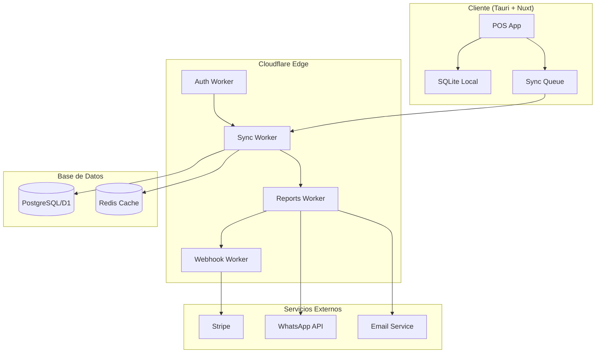
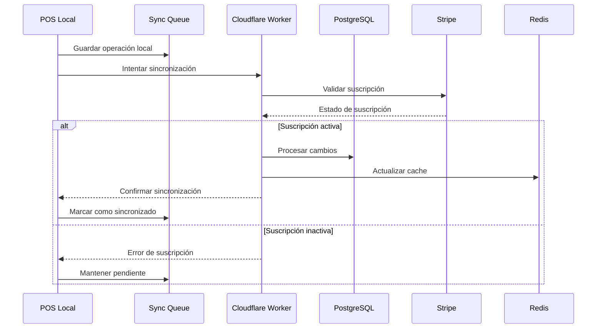

# 📄 PRD Completo – Sistema POS Abierto + SaaS (Venezuela)

## 🎯 Visión General
Un **Sistema de Punto de Venta (POS)** moderno, abierto y multiplataforma construido con **Nuxt 4 + Tauri 2**, diseñado específicamente para **pequeños y medianos comercios en Venezuela**, con un **núcleo open source gratuito** y una **capa SaaS premium** para generar ingresos y garantizar la sostenibilidad del proyecto.

### 🎯 Objetivos Estratégicos
- **Democratizar la tecnología POS** para PyMEs venezolanas con una solución gratuita y de código abierto
- **Crear un ecosistema sostenible** mediante servicios SaaS premium
- **Establecer estándares de interoperabilidad** en el mercado POS venezolano
- **Reducir la dependencia** de soluciones propietarias costosas
- **Cumplir con normativas venezolanas** (SENIAT, BCV, etc.)

---

## 🏗️ Stack Tecnológico Detallado

### Frontend & UI
- **Framework:** Nuxt 4 (modo full-stack, composition API)
- **UI Library:** @nuxt/ui + Tailwind CSS
- **Icons:** Nuxt Icons + SVGO
- **State Management:** Pinia + VueUse
- **Validation:** Zod (esquemas tipados)
- **Testing:** Vitest + Vue Test Utils

### Desktop Runtime
- **Framework:** Tauri 2 (Rust)
- **Plugins:** fs, notification, os, shell, store
- **Security:** CSP, capabilities, sandboxing
- **Multi-platform:** Windows, macOS, Linux

### Backend & Cloud
- **Runtime:** Cloudflare Workers (Edge Computing)
- **Database:**
  - Local: SQLite + Drizzle ORM
  - Cloud: PostgreSQL/D1 + Drizzle ORM
- **Authentication:** OAuth2 + JWT + 2FA
- **Payments:** Stripe (solo suscripciones SaaS)
- **Storage:** Cloudflare R2 (archivos, backups)

### DevOps & Quality
- **CI/CD:** GitHub Actions + semantic-release
- **Linting:** @antfu/eslint-config
- **Type Safety:** TypeScript strict + tslite
- **Monitoring:** Cloudflare Analytics + Sentry
- **Documentation:** Nuxt Content + TypeDoc

---

## 🇻🇪 Contexto Específico Venezuela

### 💱 Manejo de Monedas
- **Bolívares Soberanos (BS):** Moneda local principal
- **USD BCV:** Dólares según tasa oficial del Banco Central de Venezuela
- **Euros (EUR):** Moneda internacional alternativa
- **Conversión Automática:** Integración con APIs de tasas de cambio en tiempo real
- **Múltiples Precios:** Por producto en diferentes monedas
- **Tasa de Cambio:** Actualización automática cada 15 minutos

### 🏦 Sistema de Múltiples Cuentas
- **Cuenta Principal:** Caja general de la empresa
- **Cuentas Secundarias:**
  - Caja chica
  - Cuenta bancaria USD
  - Cuenta bancaria BS
  - Cuenta de efectivo EUR
  - Cuentas de terceros (proveedores, empleados)
- **Transferencias:** Entre cuentas con trazabilidad completa
- **Conciliación:** Automática con extractos bancarios

---

## 👥 Personas Objetivo Detalladas

### 🏪 Dueño de Tienda Pequeña (Free Tier)
- **Perfil:** 1-5 empleados, facturación <$50k/mes
- **Necesidades:** POS básico, offline, reportes simples
- **Pain Points:** Costos altos, dependencia de internet
- **Objetivos:** Reducir costos, simplicidad operativa

### 🍽️ Gerente de Restaurante/PyME (Pro Tier)
- **Perfil:** 5-20 empleados, múltiples turnos
- **Necesidades:** Multi-usuario, analítica, sincronización
- **Pain Points:** Control remoto, reportes consolidados
- **Objetivos:** Optimizar operaciones, crecimiento escalable

### 🏢 Franquicias/Cadenas (Enterprise)
- **Perfil:** 20+ empleados, múltiples sucursales
- **Necesidades:** Centralización, integraciones, soporte
- **Pain Points:** Consistencia entre sucursales, compliance
- **Objetivos:** Estandarización, control corporativo

---

## ⚡ Funcionalidades Core (Open Source / Gratuitas)

### 🛒 Gestión de Ventas
- **Interfaz de Venta:** Touch-friendly, búsqueda rápida
- **Múltiples Formas de Pago:** Efectivo, tarjeta, transferencia
- **Descuentos y Promociones:** Porcentaje, monto fijo, 2x1
- **Devoluciones:** Parciales y totales con trazabilidad
- **Tickets/Facturas:** Impresión térmica, email, WhatsApp

### 📦 Gestión de Productos
- **Catálogo:** Códigos de barras, categorías, variantes
- **Inventario:** Stock mínimo, alertas, ajustes
- **Precios:** Múltiples listas, descuentos por volumen
- **Imágenes:** Optimización automática con Nuxt Image

### 👥 Gestión de Clientes
- **Base de Datos:** Información básica, historial
- **Programa de Fidelidad:** Puntos básicos (local)
- **Comunicación:** SMS/Email básico

### 📊 Reportes Básicos
- **Ventas:** Diario, semanal, mensual
- **Productos:** Más vendidos, stock bajo
- **Clientes:** Frecuencia, ticket promedio
- **Exportación:** CSV, Excel, PDF

### ⚙️ Configuración
- **Multi-moneda:** Conversión automática
- **Impresoras:** Térmicas, láser, configuración
- **Backup:** Local automático, exportación manual
- **Personalización:** Logo, colores, campos

---

## 💎 Funcionalidades SaaS Premium

### 🔄 Sincronización en la Nube
- **Multi-dispositivo:** Tiempo real con WebSockets
- **Respaldo Automático:** Incremental cada 15 minutos
- **Restauración:** Punto en el tiempo, selectiva
- **Conflict Resolution:** Merge inteligente por tipo de dato
- **Offline Queue:** Sincronización diferida con retry

### 📊 Analítica Avanzada
- **Dashboard Centralizado:** KPIs en tiempo real
- **Métricas Clave:**
  - Ticket promedio y tendencias
  - Márgenes por producto/categoría
  - Proyecciones de demanda
  - Análisis de estacionalidad
- **Reportes Comparativos:** Entre sucursales, períodos
- **Alertas Inteligentes:** Stock bajo, ventas anómalas
- **Exportación Programada:** Email, FTP, APIs

### 🏢 Multi-Sucursal + Multi-Usuario
- **Gestión Centralizada:** Vista unificada de todas las tiendas
- **Roles y Permisos:**
  - Admin: Acceso total
  - Gerente: Reportes, inventario
  - Cajero: Solo ventas
  - Auditor: Solo lectura
- **Transferencias de Stock:** Entre sucursales con tracking
- **Consolidación:** Inventario y ventas unificados

### 💳 Integraciones SaaS
- **Facturación Electrónica:** Por país (México, Colombia, etc.)
- **E-commerce:** Shopify, WooCommerce, VTEX
- **Contabilidad:** QuickBooks, Xero, ContaMx
- **Marketing:** Mailchimp, HubSpot
- **API Pública:** REST + GraphQL, webhooks

### 🎯 Marketing y Fidelización
- **Comunicación Automática:**
  - Tickets por WhatsApp Business
  - Promociones por email/SMS
  - Recordatorios de cumpleaños
- **Programa de Puntos:** Configurable, múltiples niveles
- **Cupones Digitales:** QR, códigos, geolocalización
- **Segmentación:** RFM analysis, personalización

### 🔐 Seguridad y Auditoría
- **Autenticación:** OAuth2, SSO, 2FA, biometric
- **Auditoría:** Logs completos, trazabilidad
- **Compliance:** PCI DSS, GDPR, normativas locales
- **Encriptación:** End-to-end, datos en tránsito y reposo
- **Backup:** Geo-redundante, versionado

### 🤖 Inteligencia Artificial (SaaS Plus)
- **Recomendaciones:** Productos complementarios
- **Predicción de Demanda:** Machine Learning
- **Detección de Fraudes:** Patrones anómalos
- **Optimización de Precios:** Dinámicos por demanda
- **Chatbot:** Soporte automatizado

---

## 💰 Modelo de Monetización SaaS Detallado

| Plan | Precio | Dispositivos | Funcionalidades | SLA |
|------|--------|--------------|-----------------|-----|
| **Free** | $0/mes | 1 | POS local, offline, reportes básicos | Community |
| **Starter** | $19/mes | 2 | Sincronización, backup, 1 sucursal | Email |
| **Pro** | $49/mes | 5 | Multi-sucursal, analítica, integraciones | 24h |
| **Enterprise** | $149/mes | Ilimitado | API, soporte dedicado, custom | 4h |

### 💡 Estrategias de Conversión
- **Freemium:** 30 días de trial Pro automático
- **Upselling:** Notificaciones inteligentes de límites
- **Retención:** Onboarding personalizado, webinars
- **Expansión:** Add-ons por funcionalidad específica

---

## ⚙️ Sistema de Configuración Dinámico

### 🏗️ Arquitectura de Configuración
```typescript
// Schema base para configuración
export const ConfigSchema = z.object({
	id: z.string().uuid(),
	tenantId: z.string().uuid(),
	category: z.enum(["general", "currency", "accounts", "taxes", "reports", "integrations"]),
	key: z.string(),
	value: z.any(), // Valor dinámico según el tipo
	type: z.enum(["string", "number", "boolean", "object", "array"]),
	isEditable: z.boolean().default(true),
	isRequired: z.boolean().default(false),
	validation: z.object({
		min: z.number().optional(),
		max: z.number().optional(),
		pattern: z.string().optional(),
		options: z.array(z.string()).optional()
	}).optional(),
	description: z.string().optional(),
	createdAt: z.date(),
	updatedAt: z.date()
});
```

### 🎛️ Interfaz de Configuración
- **Tabs por categoría:** General, Monedas, Cuentas, Impuestos, Reportes, Integraciones
- **Edición inline:** Modificar configuraciones directamente en la interfaz
- **Validación en tiempo real:** Verificación de valores antes de guardar
- **Botones de acción:** Editar, resetear, exportar, importar

### 💾 Almacenamiento Dinámico
- **Base de datos flexible:** JSONB para valores dinámicos
- **Historial de cambios:** Trazabilidad completa de modificaciones
- **Validación con Zod:** Esquemas tipados para cada tipo de configuración
- **Cache local:** Actualización en tiempo real

---

## 🧾 Funcionalidades de Contabilidad y Cierre de Caja

### 🧾 Cierre de Caja Diario
```typescript
// Schema para Cierre de Caja
export const CashClosingSchema = z.object({
	id: z.string().uuid(),
	tenantId: z.string().uuid(),
	cashierId: z.string().uuid(),
	date: z.date(),
	accountId: z.string().uuid(), // Cuenta específica

	// Saldo inicial
	initialBalance: z.object({
		bs: z.number(),
		usd: z.number(),
		eur: z.number()
	}),

	// Ventas del día
	sales: z.object({
		bs: z.number(),
		usd: z.number(),
		eur: z.number(),
		count: z.number()
	}),

	// Gastos del día
	expenses: z.object({
		bs: z.number(),
		usd: z.number(),
		eur: z.number(),
		count: z.number()
	}),

	// Saldo final
	finalBalance: z.object({
		bs: z.number(),
		usd: z.number(),
		eur: z.number()
	}),

	// Diferencia (sobrante/faltante)
	difference: z.object({
		bs: z.number(),
		usd: z.number(),
		eur: z.number()
	}),

	status: z.enum(["open", "closed", "audited"]),
	notes: z.string().optional(),
	createdAt: z.date(),
	closedAt: z.date().optional()
});
```

### 📊 Reportes Contables Específicos
- **Estado de Cuentas:** Por moneda y cuenta
- **Flujo de Caja:** Entradas y salidas por período
- **Conciliación Bancaria:** Automática con importación de extractos
- **Libro de Ventas:** Formato requerido por SENIAT
- **Reporte de IVA:** Cálculo automático por moneda
- **Balance General:** Por cuenta y moneda

### 🏦 Integración Bancaria
- **Importación de Extractos:** CSV, Excel, PDF
- **Conciliación Automática:** Matching de transacciones
- **Transferencias:** Entre cuentas bancarias
- **Pagos a Proveedores:** Con trazabilidad completa

---

## 🔄 Sistema de Conversión de Monedas

### 🔄 Tasas de Cambio
```typescript
// Schema para Tasas de Cambio
export const ExchangeRateSchema = z.object({
	id: z.string().uuid(),
	fromCurrency: z.enum(["BS", "USD", "EUR"]),
	toCurrency: z.enum(["BS", "USD", "EUR"]),
	rate: z.number().positive(),
	source: z.enum(["BCV", "DOLAR_TODAY", "MANUAL"]),
	date: z.date(),
	isValid: z.boolean().default(true),
	createdAt: z.date()
});

// Composable para manejo de conversiones
export function useCurrencyConversion() {
	const convertAmount = (amount: number, from: string, to: string, date?: Date) => {
		// Lógica de conversión con tasas históricas
	};

	const getCurrentRates = () => {
		// Obtener tasas actuales
	};

	const formatCurrency = (amount: number, currency: string) => {
		// Formateo según moneda
	};

	return {
		convertAmount,
		getCurrentRates,
		formatCurrency
	};
}
```

### 📈 Actualización Automática
- **BCV API:** Tasa oficial del Banco Central
- **DolarToday:** Tasa paralela
- **Fallback:** Tasas manuales como respaldo
- **Histórico:** Almacenamiento de tasas por fecha
- **Alertas:** Notificaciones de cambios significativos

---

## 🏢 Funcionalidades Multi-Cuenta

### 🏦 Gestión de Cuentas
```typescript
// Schema para Cuentas
export const AccountSchema = z.object({
	id: z.string().uuid(),
	tenantId: z.string().uuid(),
	name: z.string().min(1).max(100),
	type: z.enum(["cash", "bank", "credit", "other"]),
	currency: z.enum(["BS", "USD", "EUR"]),
	bankName: z.string().optional(),
	accountNumber: z.string().optional(),
	isActive: z.boolean().default(true),
	balance: z.number().default(0),
	minBalance: z.number().default(0),
	maxBalance: z.number().optional(),
	createdAt: z.date(),
	updatedAt: z.date()
});
```

### 💸 Transacciones entre Cuentas
- **Transferencias:** Con autorización y confirmación
- **Pagos:** A proveedores desde cuenta específica
- **Reembolsos:** A clientes desde cuenta específica
- **Ajustes:** Correcciones contables
- **Reconciliación:** Automática con extractos

### 📋 Flujo de Trabajo de Cierre
1. **Apertura de Caja:** Verificación de saldo inicial
2. **Operaciones del Día:** Registro de todas las transacciones
3. **Cierre Parcial:** Por turno o cajero
4. **Cierre Final:** Conciliación completa
5. **Auditoría:** Revisión y aprobación
6. **Reportes:** Generación automática

---

## 🔄 Arquitectura Técnica Detallada

### 🏗️ Arquitectura de Microservicios


### 🗄️ Modelos de Datos (Zod Schemas)

```typescript
// Product Schema
export const ProductSchema = z.object({
	id: z.string().uuid(),
	tenantId: z.string().uuid(),
	name: z.string().min(1).max(100),
	description: z.string().optional(),
	sku: z.string().min(1).max(50),
	barcode: z.string().optional(),
	price: z.number().positive(),
	cost: z.number().nonnegative(),
	categoryId: z.string().uuid(),
	stock: z.number().int().nonnegative(),
	minStock: z.number().int().nonnegative().default(0),
	images: z.array(z.string().url()).default([]),
	isActive: z.boolean().default(true),
	createdAt: z.date(),
	updatedAt: z.date(),
	syncedAt: z.date().optional()
});

// Sale Schema
export const SaleSchema = z.object({
	id: z.string().uuid(),
	tenantId: z.string().uuid(),
	customerId: z.string().uuid().optional(),
	items: z.array(SaleItemSchema),
	subtotal: z.number().positive(),
	tax: z.number().nonnegative(),
	discount: z.number().nonnegative(),
	total: z.number().positive(),
	paymentMethod: z.enum(["cash", "card", "transfer", "mixed"]),
	status: z.enum(["completed", "refunded", "partial_refund"]),
	cashierId: z.string().uuid(),
	createdAt: z.date(),
	syncedAt: z.date().optional()
});
```

### 🔄 Flujo de Sincronización Mejorado



---

## 🛡️ Seguridad y Compliance

### 🔐 Medidas de Seguridad
- **Encriptación:** AES-256 para datos sensibles
- **Autenticación:** JWT con refresh tokens
- **Autorización:** RBAC con permisos granulares
- **Auditoría:** Logs inmutables con blockchain
- **Backup:** Encriptado, geo-redundante

### 📋 Compliance Venezuela
- **SENIAT:** Libro de ventas, reporte de IVA
- **BCV:** Tasas de cambio oficiales
- **Normativas Locales:** Facturación electrónica
- **Protección de Datos:** Ley de protección de datos personales

---

## 🚀 Estrategia de Deployment

### 📦 Distribución
- **Auto-updater:** Tauri built-in
- **Canales:** Stable, Beta, Alpha
- **Multi-platform:** Windows, macOS, Linux
- **Instaladores:** MSI, PKG, DEB, AppImage

### 🔄 CI/CD Pipeline
```yaml
# GitHub Actions Workflow
name: Build and Deploy
on:
  push:
    branches: [main, develop]
  pull_request:
    branches: [main]

jobs:
  test:
    runs-on: ubuntu-latest
    steps:
      - uses: actions/checkout@v4
      - uses: actions/setup-node@v4
      - run: pnpm install
      - run: pnpm lint
      - run: pnpm test
      - run: pnpm type-check

  build:
    needs: test
    runs-on: ubuntu-latest
    steps:
      - uses: actions/checkout@v4
      - run: pnpm tauri build
      - uses: actions/upload-artifact@v4
        with:
          name: pos-app
          path: src-tauri/target/release/

  deploy:
    needs: build
    if: github.ref == 'refs/heads/main'
    runs-on: ubuntu-latest
    steps:
      - run: semantic-release
```

---

## 📈 Métricas y KPIs

### 📊 Métricas de Producto
- **Adoption Rate:** % usuarios que usan funcionalidades premium
- **Churn Rate:** % cancelaciones mensuales
- **ARPU:** Ingreso promedio por usuario
- **LTV/CAC:** Lifetime value vs Customer acquisition cost

### 🔧 Métricas Técnicas
- **Uptime:** 99.9% SLA
- **Sync Success Rate:** >99%
- **Response Time:** <200ms API
- **Error Rate:** <0.1%

---

## 🗓️ Roadmap de Desarrollo

### 🎯 Fase 1: MVP (3 meses)
- [ ] POS básico funcional
- [ ] Gestión de productos y ventas
- [ ] Sistema multi-moneda (BS, USD, EUR)
- [ ] Cierre de caja básico
- [ ] Reportes básicos
- [ ] Sistema de configuración editable

### 🚀 Fase 2: SaaS Core (6 meses)
- [ ] Autenticación y multi-tenant
- [ ] Sincronización en la nube
- [ ] Dashboard analítico
- [ ] Integración con Stripe
- [ ] Multi-sucursal básico
- [ ] Sistema de cuentas múltiples

### 💎 Fase 3: Premium Features (9 meses)
- [ ] IA y recomendaciones
- [ ] Integraciones avanzadas
- [ ] Facturación electrónica
- [ ] API pública
- [ ] Sistema de fidelización
- [ ] Reportes contables avanzados

### 🏢 Fase 4: Enterprise (12 meses)
- [ ] White-label
- [ ] Soporte dedicado
- [ ] Customizaciones
- [ ] Compliance avanzado
- [ ] Integración bancaria completa
- [ ] Sistema de auditoría

---

## 🌍 Consideraciones Adicionales

### 🌍 Internacionalización
- **Multi-idioma:** i18n con Nuxt
- **Monedas:** Conversión automática
- **Formatos:** Fechas, números por región
- **Compliance:** Normativas por país

### ♿ Accesibilidad
- **WCAG 2.1 AA:** Cumplimiento completo
- **Screen Readers:** Soporte nativo
- **Keyboard Navigation:** Navegación completa
- **High Contrast:** Modos de contraste

### 📱 Responsive Design
- **Mobile First:** Diseño adaptativo
- **Touch Friendly:** Botones grandes
- **Offline Capable:** PWA features
- **Performance:** <3s carga inicial

---

## 📋 Resumen Ejecutivo

Este PRD define un sistema POS completo y moderno diseñado específicamente para el mercado venezolano, con las siguientes características clave:

### ✅ **Fortalezas del Sistema**
- **Open Source:** Núcleo gratuito y transparente
- **Multi-moneda:** Soporte completo para BS, USD, EUR
- **Offline-first:** Funciona sin conexión a internet
- **Configuración dinámica:** Totalmente personalizable
- **Compliance:** Cumple normativas venezolanas
- **Escalable:** De PyME a Enterprise

### 🎯 **Diferenciadores**
- **Contexto venezolano:** Diseñado para las necesidades específicas del país
- **Sistema de cuentas:** Múltiples cuentas para contabilidad completa
- **Cierre de caja:** Funcionalidades avanzadas de cierre y conciliación
- **Tasas de cambio:** Integración automática con BCV y DolarToday
- **Configuración editable:** Sistema de configuración completamente dinámico

### 🚀 **Próximos Pasos**
1. **Validar el PRD** con stakeholders y usuarios potenciales
2. **Crear prototipos** de las interfaces más críticas
3. **Definir la arquitectura de base de datos** con Drizzle ORM
4. **Configurar el pipeline de CI/CD** básico
5. **Establecer métricas de seguimiento** desde el inicio

---

*Este PRD es un documento vivo que se actualizará conforme evolucione el proyecto y se reciban feedback de usuarios y stakeholders.*
