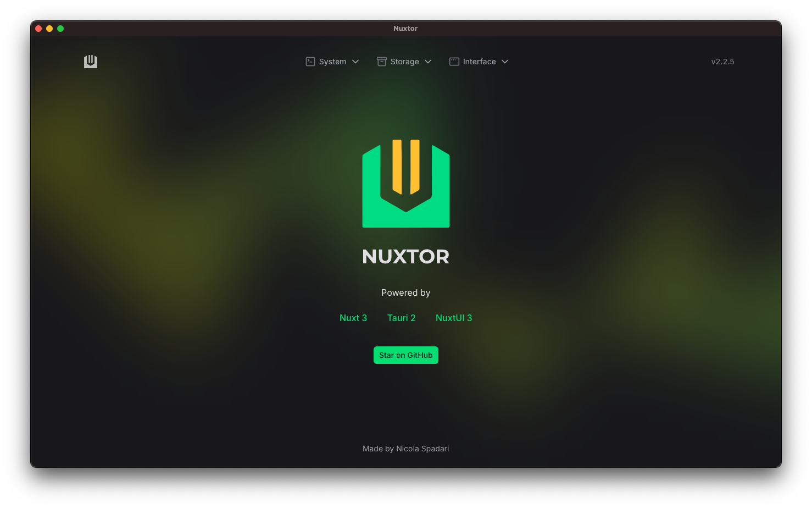

{ width=150 }

# POS System

Un sistema POS abierto para terminales de punto de venta y otros dispositivos.
Construido con [Nuxt 4](https://nuxt.com) y [Tauri 2](https://v2.tauri.app).

---


---



**Powered by Nuxt 4 + Tauri 2**

---

## 🚀 Tecnologías principales

- [Nuxt 4](https://nuxt.com)
- [Vue 3](https://vuejs.org) + [Vue Router](https://router.vuejs.org)
- [Tauri 2](https://v2.tauri.app)
- [Nuxt UI 3](https://ui.nuxt.com)
- [Zod](https://zod.dev)
- [TypeScript](https://www.typescriptlang.org)
- ESLint con [@antfu/eslint-config](https://github.com/antfu/eslint-config)
- Auto imports (también para APIs de Tauri)

---

## 🔧 Funcionalidades principales

### 🏪 **Sistema POS Completo**
- **Interfaz de venta** con catálogo de productos
- **Carrito de compras** con descuentos y cálculos automáticos
- **Procesamiento de pagos** multi-moneda (BS, USD, EUR)
- **Gestión de impuestos** (IVA 16%, ISLR 2%)

### 📦 **Gestión de Productos**
- **CRUD completo** de productos con interfaz moderna
- **Filtros avanzados** (búsqueda, categoría, estado, stock)
- **Generador automático de SKU**
- **Gestión de imágenes** con vista previa
- **Validaciones robustas** con esquemas Zod
- **Activar/desactivar** productos
- **Estadísticas en tiempo real**

### 💰 **Sistema Multi-Moneda**
- **Conversión automática** entre BS, USD, EUR
- **Tasas de cambio** en tiempo real
- **Formateo local** según estándares venezolanos
- **Histórico de tasas** de cambio

### 🖥️ **Aplicación Desktop**
- **Ejecución nativa** con Tauri 2
- **Notificaciones del sistema**
- **Acceso a información del SO**
- **Almacenamiento local** con SQLite
- **Multiplataforma** (Windows, macOS, Linux)

---

## 📱 **Páginas Disponibles**

### 🏠 **Dashboard Principal** (`/`)
- Estado del sistema y base de datos
- Tasas de cambio en tiempo real
- Acciones rápidas y navegación

### 🏪 **Punto de Venta** (`/pos`)
- Catálogo de productos con filtros
- Carrito de compras interactivo
- Procesamiento de pagos multi-moneda
- Cálculo automático de impuestos

### 📦 **Gestión de Productos** (`/products`)
- **CRUD completo** de productos
- Filtros avanzados y búsqueda
- Generador automático de SKU
- Gestión de imágenes y categorías
- Activar/desactivar productos

### 🧪 **Página de Pruebas** (`/test`)
- Estado de la base de datos
- Configuración del sistema
- Pruebas de conversión de monedas
- Validación de funcionalidades

---

## 📦 Requisitos previos

- Node.js `>=23`
- [Rust configurado](https://v2.tauri.app/start/prerequisites) (necesario para Tauri)
- [pnpm](https://pnpm.io) (enforced por el proyecto)

---

## ⚡ Instalación y uso

```bash
# Clonar el repositorio
git clone https://github.com/davidjose/pos-system
cd pos-system

# Instalar dependencias
pnpm install

# Variables de entorno (opcional)
cp env.example .env

# Desarrollo (web o desktop)
pnpm dev          # servidor Nuxt
pnpm tauri:dev    # app desktop con Tauri
```

### 🧰 Comandos útiles

```bash
# Calidad
pnpm lint
pnpm type-check
pnpm test

# Base de datos (Drizzle)
pnpm db:generate
pnpm db:migrate
pnpm db:studio

# Build
pnpm build
pnpm tauri:build
```

---

## 🧭 Documentación

- Documentación ampliada en `docs/README.md`:
  - Estructura del proyecto y convenciones
  - Base de datos y migraciones
  - Integración Tauri y plugins
  - Gestión de productos e inventario
  - Testing y calidad
  - Versionado y releases
  - Variables de entorno y scripts

Documentos relacionados en la raíz:
- `ESTADO-ACTUAL-PROYECTO.md`, `ROADMAP-TAREAS-DESARROLLO.md`
- `INTERFAZ-POS-COMPLETADA.md`, `GESTION-PRODUCTOS-COMPLETADA.md`
- `CRUD-PRODUCTOS-COMPLETADO.md` - Documentación detallada del CRUD de productos
- `BASE-DE-DATOS-INICIALIZADA.md`, `SEMANTIC-RELEASE-FIX.md`

---

## 🧾 Cierre de Caja (Resumen)

- Abrir caja desde el layout del POS con el botón “Abrir Caja”.
- Página `cash-closing`: generar reporte y terminar turno.
- Documentación completa en `docs/cash-closing.md`.

---

## 🤝 Contribución

Lee `CONTRIBUTING.md` y usa Conventional Commits para PRs.
>>>>>>> Incoming (Background Agent changes)
