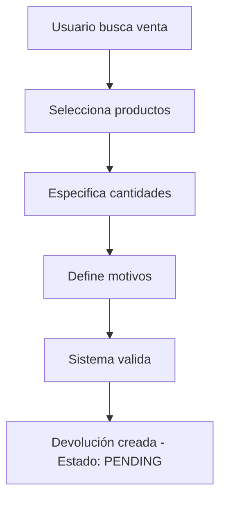
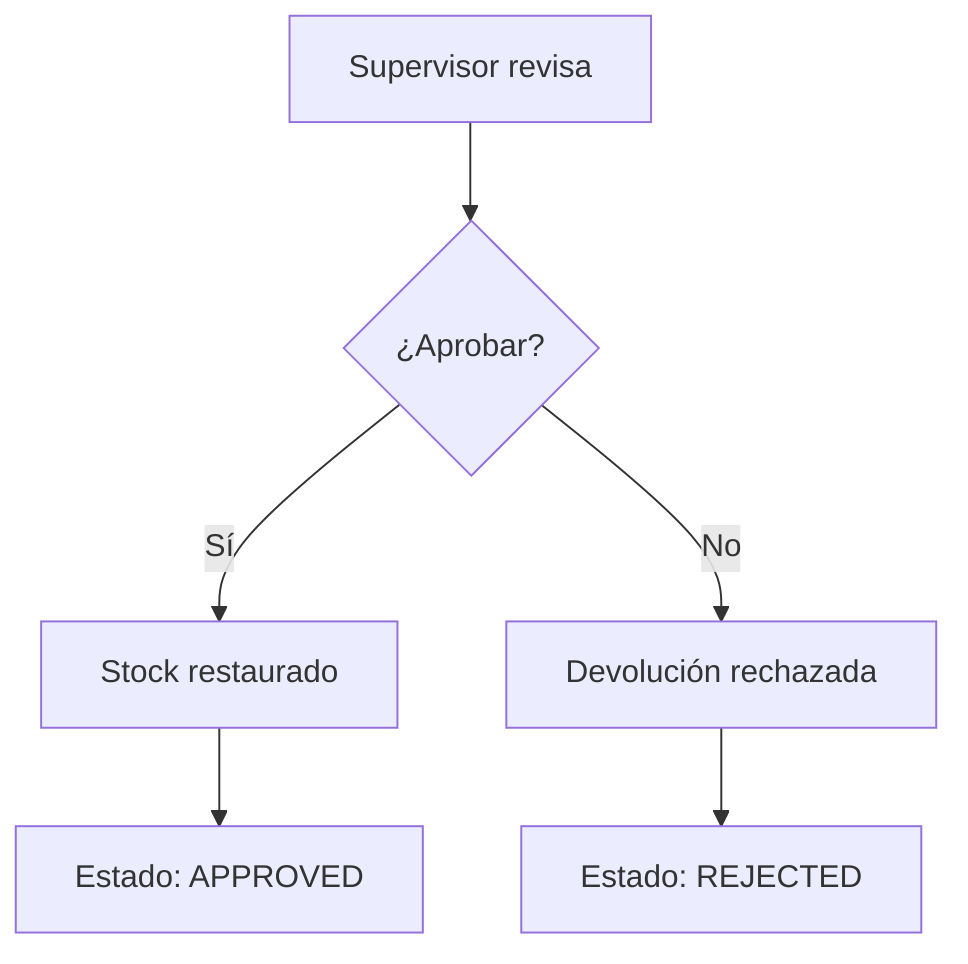
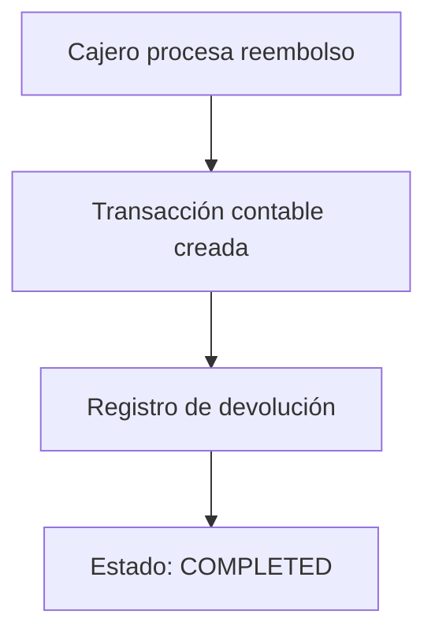

# 🔄 Sistema de Devoluciones

Documentación completa del sistema de devoluciones implementado en Open POS System.

## 📋 Índice

- [Visión General](#visión-general)
- [Arquitectura del Sistema](#arquitectura-del-sistema)
- [Base de Datos](#base-de-datos)
- [Composables](#composables)
- [Componentes UI](#componentes-ui)
- [Flujo de Trabajo](#flujo-de-trabajo)
- [Integración con POS](#integración-con-pos)
- [Página de Gestión](#página-de-gestión)
- [API y Funciones](#api-y-funciones)
- [Configuración y Migración](#configuración-y-migración)
- [Testing y Validación](#testing-y-validación)

## 🎯 Visión General

El sistema de devoluciones permite gestionar devoluciones parciales y totales con trazabilidad completa, integración con el POS y gestión automática de stock.

### Características Principales

- ✅ **Devoluciones parciales y totales** con selección granular de productos
- ✅ **Trazabilidad completa** con historial de estados y auditoría
- ✅ **Integración con POS** para búsqueda rápida de ventas
- ✅ **Gestión de stock automática** al procesar devoluciones
- ✅ **Transacciones contables** para reembolsos
- ✅ **Aprobación por supervisores** con control de permisos
- ✅ **Dashboard de gestión** con estadísticas en tiempo real

## 🏗️ Arquitectura del Sistema

### Componentes Principales

```
┌─────────────────┐    ┌─────────────────┐    ┌─────────────────┐
│   POS Interface │    │  Returns Page   │    │  Return Modal   │
│                 │    │                 │    │                 │
│ - Search Sales  │    │ - Dashboard     │    │ - Create Return │
│ - Quick Access  │    │ - Manage States │    │ - Select Items  │
│ - Integration   │    │ - View History  │    │ - Set Quantities│
└─────────────────┘    └─────────────────┘    └─────────────────┘
         │                       │                       │
         └───────────────────────┼───────────────────────┘
                                 │
                    ┌─────────────────┐
                    │  useReturns()   │
                    │                 │
                    │ - createReturn  │
                    │ - approveReturn │
                    │ - completeReturn│
                    │ - getStats      │
                    └─────────────────┘
                                 │
                    ┌─────────────────┐
                    │   Database      │
                    │                 │
                    │ - returns       │
                    │ - return_items  │
                    │ - return_status │
                    │ - return_txns   │
                    └─────────────────┘
```

## 🗄️ Base de Datos

### Tablas Implementadas

#### 1. `returns` - Tabla Principal
```sql
CREATE TABLE returns (
    id TEXT PRIMARY KEY,
    tenant_id TEXT NOT NULL,
    original_sale_id TEXT NOT NULL,
    customer_id TEXT,
    return_type TEXT NOT NULL, -- 'partial' | 'total'
    reason TEXT NOT NULL,
    status TEXT DEFAULT 'pending', -- 'pending' | 'approved' | 'rejected' | 'completed'
    subtotal REAL NOT NULL,
    tax REAL DEFAULT 0,
    discount REAL DEFAULT 0,
    total REAL NOT NULL,
    currency TEXT NOT NULL,
    cashier_id TEXT NOT NULL,
    authorized_by TEXT,
    authorized_at TEXT,
    notes TEXT,
    created_at TEXT NOT NULL,
    updated_at TEXT NOT NULL,
    completed_at TEXT
);
```

#### 2. `return_items` - Items Específicos
```sql
CREATE TABLE return_items (
    id TEXT PRIMARY KEY,
    return_id TEXT NOT NULL,
    original_sale_item_id TEXT NOT NULL,
    product_id TEXT NOT NULL,
    quantity INTEGER NOT NULL,
    original_quantity INTEGER NOT NULL,
    price REAL NOT NULL,
    total REAL NOT NULL,
    reason TEXT,
    created_at TEXT NOT NULL
);
```

#### 3. `return_status_history` - Historial de Estados
```sql
CREATE TABLE return_status_history (
    id TEXT PRIMARY KEY,
    return_id TEXT NOT NULL,
    previous_status TEXT,
    new_status TEXT NOT NULL,
    changed_by TEXT NOT NULL,
    reason TEXT,
    notes TEXT,
    created_at TEXT NOT NULL
);
```

#### 4. `return_transactions` - Transacciones Contables
```sql
CREATE TABLE return_transactions (
    id TEXT PRIMARY KEY,
    return_id TEXT NOT NULL,
    transaction_id TEXT NOT NULL,
    account_id TEXT NOT NULL,
    amount REAL NOT NULL,
    currency TEXT NOT NULL,
    exchange_rate REAL,
    description TEXT,
    created_at TEXT NOT NULL
);
```

### Índices Optimizados

```sql
-- Índices para consultas frecuentes
CREATE INDEX idx_returns_original_sale_id ON returns(original_sale_id);
CREATE INDEX idx_returns_customer_id ON returns(customer_id);
CREATE INDEX idx_returns_status ON returns(status);
CREATE INDEX idx_returns_created_at ON returns(created_at);
CREATE INDEX idx_return_items_return_id ON return_items(return_id);
CREATE INDEX idx_return_items_product_id ON return_items(product_id);
CREATE INDEX idx_return_transactions_return_id ON return_transactions(return_id);
CREATE INDEX idx_return_status_history_return_id ON return_status_history(return_id);
```

## 🔧 Composables

### `useReturns()`

Composable principal para la gestión de devoluciones.

#### Funciones Principales

```typescript
// Crear nueva devolución
const createReturn = async (input: CreateReturnInput) => Promise<string>

// Aprobar devolución y restaurar stock
const approveReturn = async (returnId: string, reason?: string) => Promise<void>

// Completar devolución y procesar reembolso
const completeReturn = async (returnId: string, paymentAccountId: string) => Promise<void>

// Rechazar devolución
const rejectReturn = async (returnId: string, reason: string) => Promise<void>

// Obtener devolución con detalles completos
const getReturnWithDetails = async (returnId: string) => Promise<ReturnWithDetails | null>

// Listar devoluciones con filtros
const listReturns = async (params: ListReturnsParams) => Promise<Return[]>

// Obtener estadísticas
const getReturnStats = async (params: StatsParams) => Promise<ReturnStats>

// Obtener items de venta para devolución
const getSaleItemsForReturn = async (saleId: string) => Promise<SaleItem[]>
```

#### Tipos TypeScript

```typescript
interface CreateReturnInput {
  originalSaleId: string;
  customerId?: string;
  returnType: "partial" | "total";
  reason: string;
  items: ReturnItemInput[];
  notes?: string;
}

interface ReturnWithDetails extends Return {
  items: ReturnItemWithProduct[];
  statusHistory: ReturnStatusHistory[];
  originalSale: {
    id: string;
    total: number;
    currency: string;
    createdAt: string;
    customerName?: string;
  };
}

interface ReturnStats {
  total_returns: number;
  pending_returns: number;
  approved_returns: number;
  completed_returns: number;
  rejected_returns: number;
  total_refunded: number;
  avg_refund_amount: number;
}
```

## 🎨 Componentes UI

### `ReturnModal.vue`

Modal completo para crear y gestionar devoluciones.

#### Características

- **Búsqueda de ventas** por ID o cliente
- **Selección de productos** con cantidades específicas
- **Tipos de devolución** (parcial/total)
- **Motivos predefinidos** y personalizados
- **Cálculo automático** de totales e impuestos
- **Validaciones completas** del formulario

#### Props

```typescript
interface Props {
  open: boolean;
  saleId?: string;
  returnId?: string;
}
```

#### Events

```typescript
interface Emits {
  'update:open': [value: boolean];
  'success': [returnId: string];
}
```

### Integración en POS

El sistema está integrado en `app/pages/pos.vue` con:

- **Botón de devolución** en el carrito de ventas
- **Modal de búsqueda** de ventas para devolver
- **Integración fluida** con el flujo de trabajo existente

## 🔄 Flujo de Trabajo

### 1. Creación de Devolución



### 2. Aprobación



### 3. Completación



## 🏪 Integración con POS

### Acceso desde POS

1. **Botón "Devolución"** en el carrito de ventas
2. **Modal de búsqueda** de ventas por ID o cliente
3. **Selección de venta** para crear devolución
4. **Modal de devolución** con selección de productos

### Búsqueda de Ventas

```typescript
// Búsqueda por ID de venta
const searchSaleById = async (saleId: string) => {
  const sales = await query(`
    SELECT s.*, c.name as customer_name
    FROM sales s
    LEFT JOIN customers c ON s.customer_id = c.id
    WHERE s.id = ?
  `, [saleId]);
  return sales.rows;
};

// Búsqueda por cliente
const searchSalesByCustomer = async (customerId: string) => {
  const sales = await query(`
    SELECT s.*, c.name as customer_name
    FROM sales s
    LEFT JOIN customers c ON s.customer_id = c.id
    WHERE s.customer_id = ?
    ORDER BY s.created_at DESC
    LIMIT 10
  `, [customerId]);
  return sales.rows;
};
```

## 📊 Página de Gestión

### `/returns` - Dashboard Completo

#### Características

- **Estadísticas en tiempo real** (total, pendientes, completadas, reembolsado)
- **Filtros avanzados** por estado, fecha, cliente
- **Lista de devoluciones** con información detallada
- **Acciones rápidas** (aprobar, rechazar, completar)
- **Modal de detalles** con historial completo
- **Paginación** para grandes volúmenes

#### Filtros Disponibles

```typescript
interface Filters {
  status?: "pending" | "approved" | "completed" | "rejected";
  from?: string; // Fecha desde
  to?: string;   // Fecha hasta
  customerId?: string;
}
```

#### Acciones por Estado

| Estado | Acciones Disponibles |
|--------|---------------------|
| `pending` | Aprobar, Rechazar |
| `approved` | Completar |
| `completed` | Ver detalles |
| `rejected` | Ver detalles |

## 🔌 API y Funciones

### Funciones de Gestión

#### Crear Devolución

```typescript
const createReturn = async (input: CreateReturnInput) => {
  // 1. Validar venta original
  // 2. Calcular totales
  // 3. Crear devolución
  // 4. Crear items
  // 5. Registrar estado inicial
  // 6. Retornar ID
};
```

#### Aprobar Devolución

```typescript
const approveReturn = async (returnId: string, reason?: string) => {
  // 1. Validar devolución
  // 2. Actualizar estado
  // 3. Registrar cambio
  // 4. Restaurar stock
  // 5. Notificar éxito
};
```

#### Completar Devolución

```typescript
const completeReturn = async (returnId: string, paymentAccountId: string) => {
  // 1. Validar devolución aprobada
  // 2. Crear transacción contable
  // 3. Registrar transacción de devolución
  // 4. Actualizar estado
  // 5. Registrar cambio
  // 6. Notificar éxito
};
```

### Validaciones

#### Esquemas Zod

```typescript
export const CreateReturnSchema = z.object({
  originalSaleId: z.string().min(1),
  customerId: z.string().optional(),
  returnType: z.enum(["partial", "total"]),
  reason: z.string().min(1),
  items: z.array(z.object({
    originalSaleItemId: z.string().min(1),
    productId: z.string().min(1),
    quantity: z.number().positive(),
    originalQuantity: z.number().positive(),
    price: z.number().positive(),
    reason: z.string().optional()
  })),
  notes: z.string().optional()
});
```

## ⚙️ Configuración y Migración

### Migración de Base de Datos

#### Archivo de Migración

```bash
# Ejecutar migración
sqlite3 src-tauri/database/pos.db < src-tauri/database/migrations/0009_add_returns_tables.sql
```

#### Verificación

```bash
# Verificar tablas creadas
sqlite3 src-tauri/database/pos.db ".tables" | grep return

# Verificar índices
sqlite3 src-tauri/database/pos.db ".indices" | grep return
```

### Configuración de Navegación

#### Categoría "Ventas"

```typescript
// app.config.ts
pageCategories: {
  sales: {
    label: "Ventas",
    icon: "lucide:shopping-cart"
  }
}
```

#### Metadatos de Página

```typescript
// app/pages/returns.vue
definePageMeta({
  name: "Devoluciones",
  description: "Gestión de devoluciones parciales y totales con trazabilidad completa",
  icon: "i-heroicons-arrow-uturn-left",
  category: "sales"
});
```

## 🧪 Testing y Validación

### Casos de Prueba

#### 1. Creación de Devolución

```typescript
// Test: Crear devolución parcial
const testCreatePartialReturn = async () => {
  const returnId = await createReturn({
    originalSaleId: "sale_123",
    returnType: "partial",
    reason: "defective",
    items: [{
      originalSaleItemId: "item_123",
      productId: "product_123",
      quantity: 1,
      originalQuantity: 2,
      price: 10.00,
      reason: "Producto defectuoso"
    }]
  });
  
  expect(returnId).toBeDefined();
  expect(returnId).toMatch(/^return_/);
};
```

#### 2. Aprobación de Devolución

```typescript
// Test: Aprobar devolución
const testApproveReturn = async () => {
  await approveReturn("return_123", "Producto defectuoso confirmado");
  
  const returnData = await getReturnWithDetails("return_123");
  expect(returnData.status).toBe("approved");
  expect(returnData.authorizedBy).toBeDefined();
};
```

#### 3. Completación de Devolución

```typescript
// Test: Completar devolución
const testCompleteReturn = async () => {
  await completeReturn("return_123", "account_123");
  
  const returnData = await getReturnWithDetails("return_123");
  expect(returnData.status).toBe("completed");
  expect(returnData.completedAt).toBeDefined();
};
```

### Validación de Integridad

#### Verificación de Stock

```typescript
// Verificar que el stock se restaura correctamente
const verifyStockRestoration = async (returnId: string) => {
  const returnData = await getReturnWithDetails(returnId);
  
  for (const item of returnData.items) {
    const product = await getProduct(item.productId);
    expect(product.stock).toBeGreaterThanOrEqual(item.quantity);
  }
};
```

#### Verificación de Transacciones

```typescript
// Verificar transacciones contables
const verifyAccountingTransactions = async (returnId: string) => {
  const transactions = await getReturnTransactions(returnId);
  expect(transactions.length).toBeGreaterThan(0);
  
  const totalAmount = transactions.reduce((sum, tx) => sum + tx.amount, 0);
  const returnData = await getReturnWithDetails(returnId);
  expect(totalAmount).toBe(returnData.total);
};
```

## 📈 Métricas y Monitoreo

### Estadísticas Disponibles

```typescript
interface ReturnStats {
  total_returns: number;        // Total de devoluciones
  pending_returns: number;      // Pendientes de aprobación
  approved_returns: number;     // Aprobadas
  completed_returns: number;    // Completadas
  rejected_returns: number;     // Rechazadas
  total_refunded: number;       // Total reembolsado
  avg_refund_amount: number;    // Promedio de reembolso
}
```

### Consultas de Monitoreo

```sql
-- Devoluciones por día
SELECT 
  DATE(created_at) as date,
  COUNT(*) as total,
  SUM(total) as amount
FROM returns 
WHERE created_at >= date('now', '-30 days')
GROUP BY DATE(created_at)
ORDER BY date DESC;

-- Productos más devueltos
SELECT 
  p.name,
  COUNT(ri.id) as return_count,
  SUM(ri.quantity) as total_quantity
FROM return_items ri
JOIN products p ON ri.product_id = p.id
GROUP BY p.id, p.name
ORDER BY return_count DESC
LIMIT 10;

-- Tiempo promedio de procesamiento
SELECT 
  AVG(
    (julianday(completed_at) - julianday(created_at)) * 24
  ) as avg_hours
FROM returns 
WHERE status = 'completed' 
  AND completed_at IS NOT NULL;
```

## 🚀 Próximas Mejoras

### Funcionalidades Planificadas

1. **Notificaciones automáticas** para supervisores
2. **Límites de devolución** por cliente
3. **Políticas de devolución** configurables
4. **Reportes avanzados** de devoluciones
5. **Integración con proveedores** para devoluciones
6. **API REST** para integraciones externas
7. **Auditoría avanzada** con logs detallados

### Optimizaciones Técnicas

1. **Caché de consultas** frecuentes
2. **Paginación optimizada** para grandes volúmenes
3. **Índices adicionales** según uso real
4. **Compresión de historial** antiguo
5. **Backup automático** de devoluciones

---

## 📚 Referencias

- [Documentación de Drizzle ORM](https://orm.drizzle.team)
- [Guías de UI de Nuxt UI](https://ui.nuxt.com)
- [Vue 3 Composition API](https://vuejs.org/guide/composition-api/)
- [TypeScript Handbook](https://www.typescriptlang.org/docs/)

---

*Documentación actualizada: Diciembre 2024*  
*Versión del sistema: 1.0.0*
